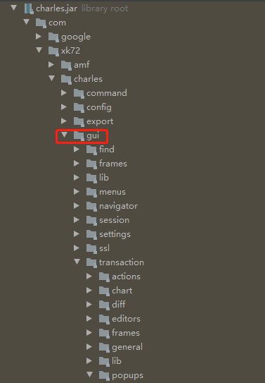
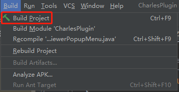

## Charles 插件开发
### 下载最新的Charles

[Charles官网地址](https://www.charlesproxy.com/)，安装后在安装目录下找到charles.jar包

### 进行开发的时候的注意事项
* 进行二次开发的的部分是Charles工具中的charles.jar包（现在不用反编译了）
* Charles每次进行版本更新后会代码会混淆，需要注意更新后charles.jar包中使用到的类名或者函数（构造方法...）名进行改名
* 要注意的一点是报名新功能报名需要跟Charles工程目录结构一致，方便后面把新功能添加至charles.jar包中
* 文档最后用到jar -uf命令

  ## JAR 命令

  | 命令     | 说明                                                         |
  | -------- | :----------------------------------------------------------- |
  | -c       | 在标准输出上创建新归档或空归档。                             |
  | -C       | 在执行 jar 命令期间更改目录。**jar -uf a.jar -C classes \*** 将 classes 目录内的所有文件加到 a.jar 中，但不添加类目录本身。 |
  | -f       | 第二个参数指定要处理的 jar 文件(文件列表中的第一个元素是要创建或访问的存档文件名字)。在 -c (创建)情形中，第二个参数指的是要创建的 jar 文件的名称(不是在标准输出上)。在 -t (表(或 -x (抽取)这两种情形中，第二个参数指定要列出或抽取的 jar 文件。 |
  | -i       | 应提供的索引信息。                                           |
  | -m       | 包括指定的现有清单文件中的清单信息（文件列表的第二个元素是外部的清单文件名）。用法举例：**jar cmf myManifestFile myJarFile \*.class** |
  | -M       | 不创建项目的清单文件。                                       |
  | -t       | 在标准输出上列出内容表(存档文件的内容应制成表格)。           |
  | -u       | 通过添加文件或更改清单来更新现有的 JAR 文件。例如：**jar -uf a.jar a.class** 将文件 a.class 添加到现有的 JAR 文件 a.jar 中，而 **jar umf manifest foo.jar** 则用 manifest 中的信息更新 a.jar 的清单。 |
  | -v       | 在标准错误输出设备上生成长格式的输出结果(当工具执行时显示的详细信息)。 |
  | -x[file] | 从标准输入提取所有文件，或只提取指定的文件。如果省略了 file，则提取所有文件；否则只提取指定文件。 |
  | -0       | 只储存，不进行 ZIP 压缩。                                    |

* 打开后找到需要修改的部分，Charles是用java语言写的界面（java swing项目），一般UI处的改动都在gui目录下



### 如何进行二次开发

1. 新建普通java项目引入Charles.jar包作为依赖,重新构造抽象类`Base64DecodeAction`，并实现两个子类，分别是选中文本弹出右键菜单和选择控件弹出右键
   与该抽象类`Base64DecodeAction`下的两个子类写法一致
2. 拿做好的一个功能来举例子，功能（解密接口请求参数），下面是完成图，新增了3个小功能解密不同的请求参数，原本Charles会自带一个Base64 Decode 功能，但是并不能满足解密需求

3. 找到Base64DecodeAction目标源码的位置，查找关键字（Base 64 Decode）

4. 重新设计自定义抽象类以及子类的功能，并把新功能的子类在`TransactionViewerPopupMenu`此类`prepare`方法中添加

### 编译代码

用IDEA自带的build进行编译，顶部菜单栏Build  ----  Build project



编译完成后会有class文件在项目out目录下生成，把编译后产物进行拷贝，放入一个目录下，注意：只需要com目录后的build产物


### 把class文件加入到jar包中

把charles.jar包和编译后的产物放到同一个目录下面，执行脚本，执行完之后新增的内容就添加进去了，然后替换掉老的jar包重新启动Charles就可以了！

```shell
#!/bin/bash
jar -uf ./charles.jar com/xk72/charles/gui/transaction/popups/CharlesUrlDecode.class
jar -uf ./charles.jar com/xk72/charles/gui/transaction/popups/CharlesUrlDecodeText.class
jar -uf ./charles.jar com/xk72/charles/gui/transaction/popups/TransactionViewerPopupMenu.class
jar -uf ./charles.jar com/xk72/charles/gui/transaction/popups/CharlesUrlDecodeTextComponent.class
jar -uf ./charles.jar com/xk72/charles/gui/transaction/popups/HttpUtils.class
jar -uf ./charles.jar com/xk72/charles/gui/transaction/popups/JsonUtils.class
jar -uf ./charles.jar com/xk72/charles/gui/transaction/popups/ResultDialog.class
```


